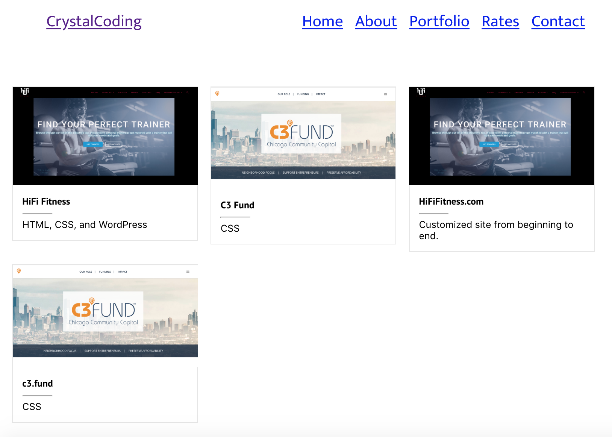

# Basic React Portfolio
Standard portfolio profile using React with gallery of work and links to pages.

This project was bootstrapped with [Create React App](https://github.com/facebook/create-react-app).

### Installing / Getting started
Clone the project. Change the directory to the project. 
Then run it:

```shell
git clone https://github.com/CrystalCo/react_profile
cd react_profile/
npm start
```

Runs the app in the development mode.<br>
Open [http://localhost:3000](http://localhost:3000) to view it in the browser.

The page will reload if you make edits.<br>
You will also see any lint errors in the console.

### Developing
#### Built With
Used React v16.6.3
<br>
react-scripts: start, build, test, eject

#### Prerequisites

Need to have React & npm installed globally.

### `npm test`

Launches the test runner in the interactive watch mode.<br>
See the section about [running tests](https://facebook.github.io/create-react-app/docs/running-tests) for more information.

